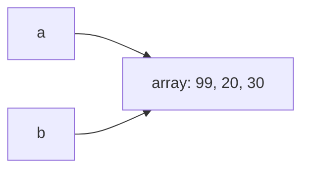

# Referências, objetos, String e arrays

Nenhum programa deste livro, até aqui, recebeu uma informação sequer de quem
o executa. Este recebe:

```java
void main() {
    String nome = IO.readln("Qual é o seu nome? ");
    IO.println("Bem-vindo, " + nome + ".");
}
```

```console
$ java Recepcao.java
Qual é o seu nome? Ana
Bem-vindo, Ana.
```

`IO.readln` escreve a pergunta, espera a resposta terminar com Enter e
devolve o que foi digitado. O valor devolvido é um texto, e texto em Java
tem tipo: `String`. A segunda linha monta a saudação com o operador `+`, que
entre textos tem outro significado, apresentado adiante. Duas linhas, e o
programa passou a depender do que quem o executa digita. O preço é que
`String` não é como os tipos que vieram antes, e a diferença entre as duas
famílias de tipos é o
assunto que dá nome a este capítulo, além de ser a origem de metade dos
defeitos difíceis de quem começa.

## String: o texto como valor

Um literal de `String` é o texto entre aspas duplas, presente desde o
`"Olá, mundo."` do capítulo 2. A novidade é que esse valor carrega
comportamento próprio: um `String` é um objeto, um valor composto que reúne
dados e métodos, e os métodos se chamam com um ponto sobre o valor:

```java
void main() {
    String curso = "Java 25";
    IO.println(curso.length());
    IO.println(curso.toUpperCase());
    IO.println(curso.charAt(0));
    IO.println(curso.substring(0, 4));
}
```

```
7
JAVA 25
J
Java
```

`length()` devolve a quantidade de caracteres; `toUpperCase()` devolve a
versão em maiúsculas; `charAt(0)` devolve o `char` da posição zero, porque
posições em Java começam do zero, um fato que volta em força na seção de
arrays; `substring(0, 4)` devolve o trecho da posição 0 até antes da 4. Os
parênteses vazios de `length()` são a primeira chamada sem argumento do
livro: chamar sem entregar valor nenhum é permitido, e os parênteses
continuam obrigatórios, porque são eles que fazem a chamada. Nenhum desses
métodos altera o texto original; os que produzem texto devolvem outro
`String`, e a seção de imutabilidade retoma essa propriedade.

O `+` entre um `String` e qualquer outro valor produz um `String` novo com
os dois emendados, e isso se chama concatenação: `"Bem-vindo, " + nome`
produziu `"Bem-vindo, Ana"`. Números entram na emenda já convertidos para
texto: `"Total: " + 7` é o texto `"Total: 7"`.

Alguns caracteres não podem ser escritos direto entre as aspas: uma aspa
dupla fecharia o literal antes da hora, e uma quebra de linha não cabe
numa linha. Para eles existe a sequência de escape, a dupla de caracteres
aberta por contrabarra que vale por um caractere só:

| Escrita | Caractere |
| --- | --- |
| `\n` | quebra de linha |
| `\t` | tabulação |
| `\"` | aspa dupla |
| `\'` | aspa simples |
| `\\` | a própria contrabarra |

`IO.println("Café\t19,90")` imprime os dois valores separados por
tabulação, e `"C:\\dados"` é o texto de oito caracteres com uma
contrabarra só. Esquecer a duplicação da contrabarra dá erro de
compilação quando a letra seguinte não forma escape nenhum, e um
caractere que ninguém pediu quando forma.

Texto de várias linhas tem forma própria, o bloco de texto: três aspas
duplas abrem, três fecham, e o conteúdo entre elas vale como está, com as
quebras de linha que tiver.

```java
String ajuda = """
        Comandos:
          vender   registra uma venda
          sair     encerra o programa
        """;
```

A indentação comum a todas as linhas é descartada pelo compilador, que a
mede pela linha menos indentada, contando também a linha que fecha o
bloco; isso permite alinhar o texto com o código em volta sem que o
alinhamento entre no valor, e recuar a linha de fechamento é o jeito de
pedir margem à esquerda no texto final. É a forma de
escrever tela de ajuda, mensagem longa e trecho de outro formato sem
encher a linha de `\n`.

O resto do repertório de `String` fica para duas seções adiante, porque um
dos métodos dele devolve um array, e array é o assunto da próxima.

## Arrays: vários valores sob um nome

Guardar as avaliações de um filme em variáveis `nota1`, `nota2`, `nota3`
para de funcionar na décima nota. Um array guarda uma sequência de valores
do mesmo tipo sob um único nome:

```java
void main() {
    int[] notas = { 8, 10, 7 };
    IO.println(notas.length);
    IO.println(notas[0]);
    notas[0] = 9;
    IO.println(notas[0]);
}
```

```
3
8
9
```

`int[]` é o tipo "array de `int`", e as chaves com valores são o
inicializador de array, uma escrita que só vale junto da declaração. Cada
posição é lida e gravada pelo índice entre colchetes, contado a partir do
zero: num array de 3 posições, os índices válidos são 0, 1 e 2. `length`,
sem parênteses, informa o tamanho, fixado na criação e imutável dali em
diante. Um array também nasce sem valores escolhidos, com a palavra `new` e
o tamanho: `new int[10]` cria dez posições valendo zero, o valor padrão de
`int`. A próxima seção mostra o que `new` faz.

Índice fora da faixa é um dos erros de execução clássicos da linguagem.
Pedir `notas[3]` ao array de três posições acima produz:

```console
$ java Notas.java
Exception in thread "main" java.lang.ArrayIndexOutOfBoundsException: Index 3 out of bounds for length 3
	at Notas.main(Notas.java:4)
```

A mensagem de `ArrayIndexOutOfBoundsException` entrega o índice pedido, o
tamanho real e a linha. Ela costuma nascer de um laço com condição `<=` onde
deveria ser `<`, porque o último índice válido é o tamanho menos um.

Percorrer um array combina com o `for` clássico, e existe uma forma
dedicada a "visitar todos", o laço for-each, que dispensa o índice quando a
posição não importa:

```java
int soma = 0;
for (int nota : notas) {
    soma += nota;
}
```

Lê-se: para cada `nota` em `notas`. A cada volta, a variável recebe o valor
da posição seguinte, do primeiro ao último.

Um array também guarda arrays, e é assim que a linguagem representa
tabela. Um array multidimensional é o array cujos elementos são outros
arrays, declarado com um par de colchetes por dimensão:

```java
void main() {
    int[][] vendasPorDiaEHora = new int[7][24];
    vendasPorDiaEHora[0][9] = 12;
    IO.println(vendasPorDiaEHora.length);
    IO.println(vendasPorDiaEHora[0].length);
    IO.println(vendasPorDiaEHora[0][9]);
}
```

```
7
24
12
```

`new int[7][24]` cria sete arrays de 24 posições e mais um array que
guarda os sete. `vendasPorDiaEHora[0]` é um array inteiro, e
`vendasPorDiaEHora[0][9]` é a posição 9 dele; percorrer a tabela toda pede
o laço aninhado do capítulo 4, um laço por dimensão. As linhas não
precisam ter o mesmo tamanho, porque cada uma é um array independente:
`new int[7][]` cria as sete posições sem as linhas, e cada linha nasce
depois com o tamanho que precisar. Daí o nome honesto da estrutura, array
de arrays, e a diferença em relação à matriz retangular de outras
linguagens.

## O repertório de String

Os quatro métodos da primeira seção são a ponta de um conjunto grande, e o
que importa dele se organiza em quatro trabalhos: perguntar sobre o texto,
procurar dentro dele, produzir texto novo e partir o texto em pedaços. Uma
etiqueta digitada por gente, com o espaço sobrando que todo formulário
produz, serve de bancada:

```java
void main() {
    String etiqueta = "  Café 500g  ";
    IO.println(etiqueta.strip() + "|");
    IO.println(etiqueta.isBlank());
    IO.println(etiqueta.contains("500"));
    IO.println(etiqueta.indexOf("500"));
    IO.println(etiqueta.strip().startsWith("Café"));
    IO.println(etiqueta.replace("500g", "1kg").strip());
}
```

```
Café 500g|
false
true
7
true
Café 1kg
```

`strip` devolve o texto sem os espaços das pontas, e a barra impressa
logo depois existe para o resultado ficar visível. `isBlank` pergunta se o
texto está vazio ou tem apenas espaço, a conferência que separa a resposta
ausente da resposta feita só de espaço; `isEmpty` é o parente estrito,
que só responde `true` para comprimento zero. `contains` responde se um
trecho aparece em algum lugar, e `indexOf` responde onde: a posição da
primeira ocorrência, ou `-1` quando não há nenhuma, a convenção de "não
achei" das buscas por posição. `startsWith` e `endsWith` perguntam pelas
pontas, o par que reconhece prefixo de código e extensão de arquivo.
`replace` troca todas as ocorrências de um trecho por outro. As chamadas
se emendam porque cada uma devolve um `String` novo, e é isso que faz
`etiqueta.replace(...).strip()` funcionar em cadeia.

| Chamada | O que devolve |
| --- | --- |
| `texto.length()` | a quantidade de caracteres |
| `texto.isEmpty()` / `texto.isBlank()` | comprimento zero / vazio ou só com espaço |
| `texto.charAt(i)` | o `char` da posição `i` |
| `texto.substring(a)` / `texto.substring(a, b)` | de `a` até o fim / de `a` até antes de `b` |
| `texto.indexOf(t)` / `texto.lastIndexOf(t)` | posição da primeira / da última ocorrência; `-1` se não houver |
| `texto.contains(t)` | se o trecho aparece |
| `texto.startsWith(t)` / `texto.endsWith(t)` | se começa / termina com o trecho |
| `texto.toUpperCase()` / `texto.toLowerCase()` | a versão em maiúsculas / em minúsculas |
| `texto.strip()` | o texto sem espaço nas pontas |
| `texto.replace(a, b)` | com todas as ocorrências de `a` trocadas por `b` |
| `texto.repeat(n)` | o texto repetido `n` vezes |
| `texto.equals(o)` / `texto.equalsIgnoreCase(o)` | conteúdo igual / igual ignorando maiúsculas |
| `texto.compareTo(o)` | negativo, zero ou positivo, na ordem alfabética |
| `texto.split(s)` | o array dos pedaços entre as ocorrências de `s` |
| `String.join(s, partes)` | os pedaços emendados com `s` entre eles |
| `String.format(molde, valores)` | o texto montado a partir de um molde |

O quarto trabalho é o que precisava do array. `split` parte o texto onde
encontra o separador e devolve os pedaços; `String.join` faz o caminho de
volta:

```java
void main() {
    String linha = "7891000100103;Café 500g;19.90";
    String[] campos = linha.split(";");
    IO.println(campos.length);
    IO.println(campos[1]);
    IO.println(String.join(" | ", campos));
}
```

```
3
Café 500g
7891000100103 | Café 500g | 19.90
```

É o formato de arquivo de texto que mais se encontra por aí, uma linha por
registro com as colunas separadas por um caractere, e o capítulo 21 grava o
estoque do mercadinho exatamente assim.
`String.join` é chamado pelo nome do tipo, sem objeto na frente, porque
não age sobre um texto existente: monta um novo a partir das partes.

A última chamada da tabela monta texto por molde, e aposenta a emenda de
pedaços com `+` quando a saída precisa ficar alinhada:

```java
void main() {
    IO.println(String.format("%-12s %3d un", "Café 500g", 25));
    IO.println(String.format("%-12s %3d un", "Sabão", 7));
}
```

```
Café 500g     25 un
Sabão          7 un
```

Cada marca começa com `%` e diz o tipo e a largura do valor que entra ali:
`%s` recebe texto, `%d` recebe inteiro, `%f` recebe ponto flutuante e `%n`
quebra a linha. O número antes da letra reserva a largura em colunas, e o
sinal de menos alinha à esquerda em vez de à direita, que é o padrão; foi
o `%-12s` que deixou as duas linhas com o número na mesma coluna. Para
ponto flutuante, `%6.2f` pede seis colunas com duas casas decimais, com
uma ressalva: a vírgula ou o ponto que separa as casas sai do idioma
configurado na máquina, e fixar a escrita em toda máquina pede a versão do
método que recebe um primeiro argumento `Locale`, o objeto que representa
uma convenção regional. O método `formatted`, chamado sobre o próprio
molde, faz o mesmo com a ordem invertida: `"%s: %d".formatted(nome, quantidade)`.

## Referências: o que a variável guarda de verdade

<div class="previsao">

Duas variáveis, um inicializador de array, uma alteração:

```java
void main() {
    int[] a = { 10, 20, 30 };
    int[] b = a;
    b[0] = 99;
    IO.println(a[0]);
}
```

A alteração foi feita através de `b`. O que imprime a leitura através de
`a`?

</div>

```
99
```

Uma variável de tipo primitivo guarda o
próprio valor; uma variável de tipo objeto, como `String` e arrays, não
guarda o objeto: guarda o endereço dele, e esse endereço se chama
referência. Quando `int[] b = a` executa, o que se copia é o endereço, não o
array: passa a haver um array e dois nomes para ele, e mutação através de um
nome é visível através do outro. O compilador não avisa nada, porque nada
está errado; apenas é assim que referências funcionam.



Os objetos em si vivem numa região da memória chamada heap, criados pelo
`new` ou pelo inicializador, e as variáveis vivem na pilha de chamadas; o
que elas guardam de um objeto é só a referência para lá. Cada objeto criado tem
identidade: é ele mesmo, distinto de qualquer outro, mesmo que outro objeto
tenha conteúdo idêntico. Dois arrays criados com `{ 10, 20, 30 }` duas vezes
são dois objetos; `a` e `b` acima são dois nomes para um só.

<div class="armadilha">

Um método que só deveria calcular:

```java
int menorNota(int[] notas) {
    int menor = notas[0];
    for (int i = 0; i < notas.length; i++) {
        if (notas[i] < menor) {
            menor = notas[i];
        }
        notas[i] = 0; // limpa o rascunho, acreditando ser uma cópia
    }
    return menor;
}

void main() {
    int[] notas = { 8, 9, 7 };
    IO.println(menorNota(notas));
    IO.println(notas[0]);
}
```

```
7
0
```

O método devolveu o menor valor, mas a segunda impressão mostra o array de
`main` alterado: a limpeza, escrita na crença de que o parâmetro era uma
cópia, zerou o array original.

</div>

Quando o tipo de um parâmetro é um objeto, o que ele recebe é uma cópia da
referência, e portanto aponta para o mesmo objeto de quem chamou: o que o método altera, o chamador
vê. Não há erro em nenhum momento, e o defeito aparece longe da causa, em
qualquer código que use o array depois. A disciplina que evita essa família
de bugs é dupla: métodos que calculam não alteram o que recebem, e métodos
que alteram dizem isso no nome.

## Igualdade: `==` compara identidade, `equals` compara conteúdo

<div class="armadilha">

Um cofre com senha:

```java
void main() {
    String digitada = IO.readln("Senha: ");
    if (digitada == "abracadabra") {
        IO.println("Cofre aberto.");
    } else {
        IO.println("Senha errada.");
    }
}
```

```console
$ java Cofre.java
Senha: abracadabra
Senha errada.
```

A senha digitada está correta, o programa compila, roda e nega.

</div>

Entre referências, `==` pergunta se os dois lados apontam para o mesmo
objeto, a identidade, e não se os conteúdos coincidem. O texto digitado é um
objeto novo, criado na leitura; o literal `"abracadabra"` é outro; conteúdos
iguais, objetos distintos, `==` falso. A pergunta certa para conteúdo tem
nome: `equals`.

```java
if (digitada.equals("abracadabra")) {
```

A regra de bolso do capítulo: primitivos se comparam com `==`; objetos, com
`equals`. O perigo desta armadilha é ela fingir que funciona: comparando
dois literais iguais no mesmo teste rápido, o `==` chega a valer `true`, e o
aprofundamento abaixo explica o porquê; o defeito só aparece com texto vindo
de fora, longe do teste que "provou" que estava certo.

<div class="aprofundamento">

**O pool de literais.** Literais de `String` idênticos no código são
guardados uma vez só, numa área chamada pool, e por isso `"a" == "a"` vale
`true`: são o mesmo objeto. Texto construído em execução, como o devolvido
por `IO.readln`, nasce fora do pool. É uma economia de memória da JVM, não
uma regra de igualdade em que se possa apoiar.

</div>

## A classe Arrays, e o parâmetro que aceita quantos vierem

Imprimir um array direto não dá o que se espera:

```java
int[] notas = { 8, 10, 7 };
IO.println(notas);
```

```
[I@6f2b958e
```

O que sai é `[I`, a marca interna de "array de `int`", seguida de um
número derivado da identidade do objeto, o mesmo assunto da seção
anterior: sem instrução em contrário, um objeto se apresenta por
identidade, não por conteúdo. A biblioteca padrão resolve isso, e mais uma
dúzia de tarefas de array, na classe `Arrays`, que é uma classe
utilitária: a classe da qual nunca se cria objeto, existente só para
reunir métodos chamados pelo nome dela.

```java
void main() {
    int[] notas = { 8, 10, 7 };
    IO.println(Arrays.toString(notas));
    Arrays.sort(notas);
    IO.println(Arrays.toString(notas));

    int[] copia = Arrays.copyOf(notas, notas.length);
    IO.println(Arrays.equals(notas, copia));
    IO.println(notas == copia);
}
```

```
[8, 10, 7]
[7, 8, 10]
true
false
```

`toString` produz a forma legível, e é a chamada que falta em todo
programa que imprime array. `sort` ordena o array recebido no lugar,
alterando o próprio objeto, com a consequência que a armadilha da seção
anterior já cobrou: quem passa um array para `sort` não fica com o
original. `copyOf` devolve um array novo com o conteúdo copiado e o
tamanho pedido, completando com o valor padrão do tipo ou cortando o
excesso quando o tamanho pedido difere do original; é a resposta pronta
para o desfazer-o-compartilhamento que o exercício 2 pede à mão. E as duas
últimas linhas põem as duas perguntas lado a lado sobre os mesmos dois
arrays: mesmo conteúdo, sim; mesmo objeto, não.

| Chamada | O que faz |
| --- | --- |
| `Arrays.toString(a)` | a forma legível do conteúdo |
| `Arrays.deepToString(a)` | a forma legível de array multidimensional |
| `Arrays.sort(a)` | ordena o próprio array, no lugar |
| `Arrays.copyOf(a, n)` | array novo de `n` posições, com o conteúdo de `a` |
| `Arrays.copyOfRange(a, i, f)` | array novo com o trecho de `i` até antes de `f` |
| `Arrays.equals(a, b)` | conteúdo igual, posição a posição |
| `Arrays.fill(a, v)` | grava `v` em todas as posições |

O array também sustenta uma forma de declarar parâmetro que aparece na
biblioteca inteira. Varargs é o parâmetro que aceita zero ou mais valores
do mesmo tipo, declarado com três pontos entre o tipo e o nome:

```java
int soma(int... valores) {
    int total = 0;
    for (int valor : valores) {
        total += valor;
    }
    return total;
}

void main() {
    IO.println(soma(3, 4));
    IO.println(soma(1, 2, 3, 4, 5));
    IO.println(soma());
}
```

```
7
15
0
```

Dentro do método, `valores` é um array comum, com `length` e índice; quem
embrulha os argumentos soltos num array é o compilador, na hora da
chamada, e a chamada sem argumento nenhum recebe um array de tamanho zero,
não `null`. Duas regras acompanham a forma: o varargs é o último parâmetro
da lista, porque nada poderia vir depois de "quantos vierem", e cada
método tem no máximo um. É assim que `String.format` aceita qualquer
quantidade de valores depois do molde.

## Imutabilidade e StringBuilder

Nenhum método de `String` altera o texto: todos devolvem um `String` novo, e
o original permanece intacto. Essa propriedade se chama imutabilidade, e é
uma decisão deliberada da linguagem:

```java
String curso = "java";
curso.toUpperCase();
IO.println(curso);
```

```
java
```

A segunda linha não é uma ordem para maiúsculas: é uma expressão cujo
resultado, um `String` novo, foi jogado fora. Para ficar com o resultado,
guarda-se o valor devolvido: `curso = curso.toUpperCase()`. A imutabilidade
tem um preço quando o texto cresce aos pedaços: cada `+` cria um objeto
novo, e mil voltas de concatenação criam mil objetos intermediários. Para
montagem em etapas existe o `StringBuilder`, um objeto de texto que aceita
alteração:

```java
StringBuilder relatorio = new StringBuilder();
for (int nota : notas) {
    relatorio.append(nota);
    relatorio.append(" ");
}
IO.println(relatorio);
```

`new StringBuilder()` cria o objeto vazio, `append` acrescenta no fim, e
`IO.println` o aceita diretamente. Como qualquer objeto vira texto na hora
de imprimir é assunto do capítulo 10. A regra prática: concatenação com `+`
para emendas pontuais; `StringBuilder` para montagem dentro de laço.

O objeto tem mais do que o `append`. `insert(posicao, valor)` enfia um
valor no meio do que já está montado; `delete(inicio, fim)` remove um
trecho e `deleteCharAt(posicao)` remove um caractere, que é a saída para a
vírgula sobrando no fim de uma lista montada em laço; `reverse()` inverte
a ordem; `length()` conta o que já entrou; `setLength(0)` esvazia o objeto
para ele ser reaproveitado na montagem seguinte; e `toString()` fecha a
montagem devolvendo o `String` final, que é o tipo esperado por quem
recebe texto. O `append` aceita valor de qualquer tipo, convertendo-o em
texto, e devolve o próprio `StringBuilder`, o que permite emendar chamadas
numa linha só: `relatorio.append(nome).append(": ").append(quantidade)`.

## null e a entrada que vira número

Uma referência pode não apontar para objeto nenhum, e o literal desse estado
é `null`. Chamar qualquer método através de uma referência nula derruba o
programa com um erro de execução: o `NullPointerException`. O programa
abaixo, salvo em `Cadastro.java`, o provoca:

```java
void main() {
    String nome = null;
    IO.println(nome.length());
}
```

```console
$ java Cadastro.java
Exception in thread "main" java.lang.NullPointerException: Cannot invoke "String.length()" because "<local1>" is null
	at Cadastro.main(Cadastro.java:3)
```

A mensagem diz qual chamada falhou e sobre o quê: o `<local1>` é a variável
`nome`, cujo nome o compilador descarta na tradução, restando a posição
dela. A linha aponta o local da queda; a causa verdadeira, porém, costuma
estar antes, no ponto que deixou a referência nula. Nos programas deste
livro, `null` quase não aparece por enquanto; ele volta no capítulo 17,
quando buscas passam a poder terminar sem encontrar nada.

`IO.readln` devolve sempre `String`, inclusive quando o usuário digita um
número: `"25"` é texto, e `"25" + 1` é a concatenação `"251"`, não a soma
26. A ponte para a aritmética é `Integer.parseInt`, que converte o texto num
`int`:

```java
void main() {
    String resposta = IO.readln("Sua idade: ");
    int idade = Integer.parseInt(resposta);
    IO.println(idade + 1);
}
```

Texto que não é um número derruba a conversão com um erro de execução
chamado `NumberFormatException`, cuja mensagem mostra o texto recusado. O
que fazer para o programa sobreviver a uma entrada malformada, em vez de
cair, é assunto do capítulo 13. O nome `Integer`, e a família de que ele
faz parte, é assunto do capítulo 17; por ora ele é o endereço onde mora a
conversão.

## A segunda forma de main

O capítulo 2 prometeu uma forma de `main` que recebe o que foi digitado no
terminal depois do nome do programa. As peças deste capítulo a destravam:

```java
void main(String[] args) {
    int a = Integer.parseInt(args[0]);
    int b = Integer.parseInt(args[1]);
    IO.println(a + b);
}
```

```console
$ java Soma.java 2 3
5
```

`args` é um array de `String` com os argumentos da linha de comando, na
ordem digitada: `args[0]` é `"2"`, `args[1]` é `"3"`, e `args.length` diz
quantos vieram. Executado sem argumentos, o programa cai com o
`ArrayIndexOutOfBoundsException` deste capítulo, pedindo o índice 0 de
um array de tamanho zero; conferir `args.length` antes de ler é o hábito que
evita a queda. As duas formas de `main` convivem na linguagem, e a JVM
prefere a que declara o array quando as duas existem no arquivo.

## Prática

1. Escreva um programa que pergunte o nome e imprima três linhas: o nome em
   maiúsculas, a quantidade de caracteres e a primeira letra. Use apenas
   métodos apresentados neste capítulo.

2. Reproduza a previsão dos dois nomes com um array seu e desfaça o
   compartilhamento: crie um segundo array do mesmo tamanho com `new` e
   copie os valores com um laço, provando com impressões que a alteração num
   deles parou de afetar o outro.

3. Escreva um método `media` que receba um array de `int` e devolva a média
   como `double`, sem alterar o array recebido, usando a promoção do
   capítulo 3 para não cair na divisão inteira. Imprima a média de
   `{ 7, 8, 10 }`.

4. Reproduza a armadilha do cofre com `==`, conserte com `equals` e depois
   quebre de novo: compare dois literais iguais com `==` e explique por
   escrito, citando o pool, por que esse caso engana.

5. Com `StringBuilder` e um laço, monte numa única linha os números de 1 a
   10 separados por vírgula, sem vírgula sobrando no fim.

6. Escreva um programa que receba dois números pela linha de comando e
   imprima a soma, e que, executado com menos de dois argumentos, imprima
   uma instrução de uso em vez de cair. Anote qual erro de execução ele
   sofria antes da sua proteção.

7. Escreva um método que receba o nome de um produto digitado com sujeira,
   como `"  café 500G  "`, e devolva a versão limpa e padronizada: sem
   espaço nas pontas, com a primeira letra maiúscula e o resto minúsculo.
   Use `strip`, `substring`, `toUpperCase` e `toLowerCase`, e recuse com
   uma mensagem o texto que `isBlank` reprovar.

8. Parta a linha `"7891000100103;Café 500g;19.90;25"` com `split`, imprima
   cada pedaço numerado, converta o último para `int` e o remonte com
   `String.join` usando vírgula no lugar do ponto e vírgula. Depois repita
   com uma linha em que o nome do produto contém um ponto e vírgula, e
   descreva por escrito o que acontece com a contagem de pedaços.

9. Imprima uma tabela de cinco produtos com `String.format`, em três
   colunas alinhadas: nome à esquerda em doze colunas, quantidade à
   direita em três, e a palavra `un`. Depois monte a mesma tabela com
   concatenação e `+` e compare as duas versões por escrito.

10. Com um array de cinco notas, imprima o array direto, depois com
    `Arrays.toString`, ordene com `Arrays.sort`, copie com `Arrays.copyOf`
    e prove com duas impressões que a cópia tem o mesmo conteúdo e não é o
    mesmo objeto. Refaça o exercício 2 usando `copyOf` no lugar do laço.

11. Escreva `int soma(int... valores)` e `double media(int... valores)`,
    com a média recusando a chamada sem argumento nenhum em vez de dividir
    por zero. Chame as duas com nenhum, um e cinco valores.

12. Monte a tabuada de 1 a 10 num `int[10][10]` com laços aninhados,
    imprima-a com `Arrays.deepToString` e depois linha a linha com
    `Arrays.toString`. Explique por escrito por que `Arrays.toString`
    sozinho não serve para a tabela inteira.

## Ficha do capítulo

| Chamada | O que faz |
| --- | --- |
| `texto.length()` / `charAt(i)` / `substring(a, b)` | tamanho, caractere da posição, trecho |
| `texto.strip()` / `isBlank()` / `isEmpty()` | limpeza das pontas e as duas perguntas de vazio |
| `texto.contains(t)` / `indexOf(t)` / `startsWith(t)` | se aparece, onde aparece, se começa assim |
| `texto.toUpperCase()` / `toLowerCase()` / `replace(a, b)` | as versões de caixa e a troca de trecho |
| `texto.equals(o)` / `equalsIgnoreCase(o)` / `compareTo(o)` | conteúdo igual, igual sem caixa, ordem alfabética |
| `texto.split(s)` / `String.join(s, partes)` | parte o texto num array / emenda as partes |
| `String.format(molde, valores)` | monta texto por molde: `%s`, `%d`, `%f`, largura e alinhamento |
| `montagem.append(x)` / `insert` / `deleteCharAt` / `toString()` | montagem em etapas no `StringBuilder` |
| `Arrays.toString(a)` / `sort` / `copyOf` / `equals` / `fill` | as operações de array na classe utilitária |
| `Integer.parseInt(texto)` | converte o texto num `int` |
| `IO.readln(pergunta)` | escreve a pergunta e devolve a linha digitada |
| `new int[n]` / `new int[l][c]` | array de `n` posições / tabela de `l` linhas por `c` colunas |

| Termo | Definição |
| --- | --- |
| objeto | valor composto que reúne dados e métodos, criado durante a execução |
| referência | o endereço de um objeto; é o que a variável de tipo objeto guarda |
| `new` | cria um objeto e devolve a referência para ele |
| heap | região da memória onde os objetos vivem |
| identidade | cada objeto é ele mesmo, distinto até de outro de conteúdo igual |
| `null` | referência que não aponta para objeto nenhum |
| `NullPointerException` | erro de execução ao usar uma referência nula |
| `String` | o tipo do texto; objeto imutável |
| `equals` | comparação de conteúdo entre objetos |
| concatenação | o `+` entre `String` e outro valor, produzindo `String` novo |
| imutabilidade | propriedade do objeto que nunca muda após criado |
| `StringBuilder` | objeto de texto alterável, para montagem em etapas |
| `toString` | a forma em texto de um objeto; o capítulo 10 volta a ele |
| sequência de escape | `\n`, `\t`, `\"`, `\\`: um caractere escrito com dois |
| bloco de texto | literal de várias linhas entre três aspas duplas |
| `String.format` | monta texto a partir de um molde com marcas `%` |
| `String.join` | emenda partes com um separador entre elas |
| classe utilitária | classe da qual não se cria objeto; só reúne métodos chamados pelo nome dela |
| classe `Arrays` | a utilitária dos arrays: forma legível, ordenação, cópia, igualdade |
| array multidimensional | array cujos elementos são arrays; um colchete por dimensão |
| varargs | parâmetro que aceita zero ou mais valores; é um array por dentro |
| `Integer.parseInt` | converte `String` em `int`; recusa texto malformado |
| `IO.readln` | lê uma linha do terminal e a devolve como `String` |
| array | sequência de tamanho fixo de valores do mesmo tipo |
| índice | posição num array, contada do zero |
| `ArrayIndexOutOfBoundsException` | erro de execução por índice fora da faixa |
| laço for-each | percorre todos os valores sem usar índice |
| `String[] args` | forma de `main` que recebe os argumentos da linha de comando |
