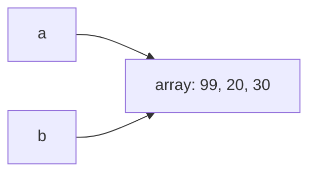

# Referências, objetos, String e arrays

Nenhum programa deste livro, até aqui, recebeu uma informação sequer de quem
o executa. Este recebe:

```java
void main() {
    String nome = IO.readln("Qual é o seu nome? ");
    IO.println("Bem-vindo, " + nome + ".");
}
```

```console
$ java Recepcao.java
Qual é o seu nome? Ana
Bem-vindo, Ana.
```

`IO.readln` escreve a pergunta, espera a resposta terminar com Enter e
devolve o que foi digitado. O valor devolvido é um texto, e texto em Java
tem tipo: `String`. A segunda linha monta a saudação com o operador `+`, que
entre textos tem outro significado, apresentado adiante. Duas linhas, e o
programa passou a depender do que quem o executa digita. O preço é que
`String` não é como os tipos que vieram antes, e a diferença entre as duas
famílias de tipos é o
assunto que dá nome a este capítulo, além de ser a origem de metade dos
defeitos difíceis de quem começa.

## String: o texto como valor

Um literal de `String` é o texto entre aspas duplas, presente desde o
`"Olá, mundo."` do capítulo 2. A novidade é que esse valor carrega
comportamento próprio: um `String` é um objeto, um valor composto que reúne
dados e métodos, e os métodos se chamam com um ponto sobre o valor:

```java
void main() {
    String curso = "Java 25";
    IO.println(curso.length());
    IO.println(curso.toUpperCase());
    IO.println(curso.charAt(0));
    IO.println(curso.substring(0, 4));
}
```

```
7
JAVA 25
J
Java
```

`length()` devolve a quantidade de caracteres; `toUpperCase()` devolve a
versão em maiúsculas; `charAt(0)` devolve o `char` da posição zero, porque
posições em Java começam do zero, um fato que volta em força na seção de
arrays; `substring(0, 4)` devolve o trecho da posição 0 até antes da 4. Os
parênteses vazios de `length()` são a primeira chamada sem argumento do
livro: chamar sem entregar valor nenhum é permitido, e os parênteses
continuam obrigatórios, porque são eles que fazem a chamada. Nenhum desses
métodos altera o texto original; os que produzem texto devolvem outro
`String`, e a seção de imutabilidade retoma essa propriedade.

O `+` entre um `String` e qualquer outro valor produz um `String` novo com
os dois emendados, e isso se chama concatenação: `"Bem-vindo, " + nome`
produziu `"Bem-vindo, Ana"`. Números entram na emenda já convertidos para
texto: `"Total: " + 7` é o texto `"Total: 7"`.

## Arrays: vários valores sob um nome

Guardar as avaliações de um filme em variáveis `nota1`, `nota2`, `nota3`
para de funcionar na décima nota. Um array guarda uma sequência de valores
do mesmo tipo sob um único nome:

```java
void main() {
    int[] notas = { 8, 10, 7 };
    IO.println(notas.length);
    IO.println(notas[0]);
    notas[0] = 9;
    IO.println(notas[0]);
}
```

```
3
8
9
```

`int[]` é o tipo "array de `int`", e as chaves com valores são o
inicializador de array, uma escrita que só vale junto da declaração. Cada
posição é lida e gravada pelo índice entre colchetes, contado a partir do
zero: num array de 3 posições, os índices válidos são 0, 1 e 2. `length`,
sem parênteses, informa o tamanho, fixado na criação e imutável dali em
diante. Um array também nasce sem valores escolhidos, com a palavra `new` e
o tamanho: `new int[10]` cria dez posições valendo zero, o valor padrão de
`int`. A próxima seção mostra o que `new` faz.

Índice fora da faixa é um dos erros de execução clássicos da linguagem.
Pedir `notas[3]` ao array de três posições acima produz:

```console
$ java Notas.java
Exception in thread "main" java.lang.ArrayIndexOutOfBoundsException: Index 3 out of bounds for length 3
	at Notas.main(Notas.java:4)
```

A mensagem de `ArrayIndexOutOfBoundsException` entrega o índice pedido, o
tamanho real e a linha. Ela costuma nascer de um laço com condição `<=` onde
deveria ser `<`, porque o último índice válido é o tamanho menos um.

Percorrer um array combina com o `for` clássico, e existe uma forma
dedicada a "visitar todos", o laço for-each, que dispensa o índice quando a
posição não importa:

```java
int soma = 0;
for (int nota : notas) {
    soma += nota;
}
```

Lê-se: para cada `nota` em `notas`. A cada volta, a variável recebe o valor
da posição seguinte, do primeiro ao último.

## Referências: o que a variável guarda de verdade

<div class="previsao">

Duas variáveis, um inicializador de array, uma alteração:

```java
void main() {
    int[] a = { 10, 20, 30 };
    int[] b = a;
    b[0] = 99;
    IO.println(a[0]);
}
```

A alteração foi feita através de `b`. O que imprime a leitura através de
`a`?

</div>

```
99
```

Uma variável de tipo primitivo guarda o
próprio valor; uma variável de tipo objeto, como `String` e arrays, não
guarda o objeto: guarda o endereço dele, e esse endereço se chama
referência. Quando `int[] b = a` executa, o que se copia é o endereço, não o
array: passa a haver um array e dois nomes para ele, e mutação através de um
nome é visível através do outro. O compilador não avisa nada, porque nada
está errado; apenas é assim que referências funcionam.



Os objetos em si vivem numa região da memória chamada heap, criados pelo
`new` ou pelo inicializador, e as variáveis vivem na pilha de chamadas; o
que elas guardam de um objeto é só a referência para lá. Cada objeto criado tem
identidade: é ele mesmo, distinto de qualquer outro, mesmo que outro objeto
tenha conteúdo idêntico. Dois arrays criados com `{ 10, 20, 30 }` duas vezes
são dois objetos; `a` e `b` acima são dois nomes para um só.

<div class="armadilha">

Um método que só deveria calcular:

```java
int menorNota(int[] notas) {
    int menor = notas[0];
    for (int i = 0; i < notas.length; i++) {
        if (notas[i] < menor) {
            menor = notas[i];
        }
        notas[i] = 0; // limpa o rascunho, acreditando ser uma cópia
    }
    return menor;
}

void main() {
    int[] notas = { 8, 9, 7 };
    IO.println(menorNota(notas));
    IO.println(notas[0]);
}
```

```
7
0
```

O método devolveu o menor valor, mas a segunda impressão mostra o array de
`main` alterado: a limpeza, escrita na crença de que o parâmetro era uma
cópia, zerou o array original.

</div>

Quando o tipo de um parâmetro é um objeto, o que ele recebe é uma cópia da
referência, e portanto aponta para o mesmo objeto de quem chamou: o que o método altera, o chamador
vê. Não há erro em nenhum momento, e o defeito aparece longe da causa, em
qualquer código que use o array depois. A disciplina que evita essa família
de bugs é dupla: métodos que calculam não alteram o que recebem, e métodos
que alteram dizem isso no nome.

## Igualdade: `==` compara identidade, `equals` compara conteúdo

<div class="armadilha">

Um cofre com senha:

```java
void main() {
    String digitada = IO.readln("Senha: ");
    if (digitada == "abracadabra") {
        IO.println("Cofre aberto.");
    } else {
        IO.println("Senha errada.");
    }
}
```

```console
$ java Cofre.java
Senha: abracadabra
Senha errada.
```

A senha digitada está correta, o programa compila, roda e nega.

</div>

Entre referências, `==` pergunta se os dois lados apontam para o mesmo
objeto, a identidade, e não se os conteúdos coincidem. O texto digitado é um
objeto novo, criado na leitura; o literal `"abracadabra"` é outro; conteúdos
iguais, objetos distintos, `==` falso. A pergunta certa para conteúdo tem
nome: `equals`.

```java
if (digitada.equals("abracadabra")) {
```

A regra de bolso do capítulo: primitivos se comparam com `==`; objetos, com
`equals`. O perigo desta armadilha é ela fingir que funciona: comparando
dois literais iguais no mesmo teste rápido, o `==` chega a valer `true`, e o
aprofundamento abaixo explica o porquê; o defeito só aparece com texto vindo
de fora, longe do teste que "provou" que estava certo.

<div class="aprofundamento">

**O pool de literais.** Literais de `String` idênticos no código são
guardados uma vez só, numa área chamada pool, e por isso `"a" == "a"` vale
`true`: são o mesmo objeto. Texto construído em execução, como o devolvido
por `IO.readln`, nasce fora do pool. É uma economia de memória da JVM, não
uma regra de igualdade em que se possa apoiar.

</div>

## Imutabilidade e StringBuilder

Nenhum método de `String` altera o texto: todos devolvem um `String` novo, e
o original permanece intacto. Essa propriedade se chama imutabilidade, e é
uma decisão deliberada da linguagem:

```java
String curso = "java";
curso.toUpperCase();
IO.println(curso);
```

```
java
```

A segunda linha não é uma ordem para maiúsculas: é uma expressão cujo
resultado, um `String` novo, foi jogado fora. Para ficar com o resultado,
guarda-se o valor devolvido: `curso = curso.toUpperCase()`. A imutabilidade
tem um preço quando o texto cresce aos pedaços: cada `+` cria um objeto
novo, e mil voltas de concatenação criam mil objetos intermediários. Para
montagem em etapas existe o `StringBuilder`, um objeto de texto que aceita
alteração:

```java
StringBuilder relatorio = new StringBuilder();
for (int nota : notas) {
    relatorio.append(nota);
    relatorio.append(" ");
}
IO.println(relatorio);
```

`new StringBuilder()` cria o objeto vazio, `append` acrescenta no fim, e
`IO.println` o aceita diretamente. Como qualquer objeto vira texto na hora
de imprimir é assunto do capítulo 10. A regra prática: concatenação com `+`
para emendas pontuais; `StringBuilder` para montagem dentro de laço.

## null e a entrada que vira número

Uma referência pode não apontar para objeto nenhum, e o literal desse estado
é `null`. Chamar qualquer método através de uma referência nula derruba o
programa com um erro de execução: o `NullPointerException`. O programa
abaixo, salvo em `Cadastro.java`, o provoca:

```java
void main() {
    String nome = null;
    IO.println(nome.length());
}
```

```console
$ java Cadastro.java
Exception in thread "main" java.lang.NullPointerException: Cannot invoke "String.length()" because "<local1>" is null
	at Cadastro.main(Cadastro.java:3)
```

A mensagem diz qual chamada falhou e sobre o quê: o `<local1>` é a variável
`nome`, cujo nome o compilador descarta na tradução, restando a posição
dela. A linha aponta o local da queda; a causa verdadeira, porém, costuma
estar antes, no ponto que deixou a referência nula. Nos programas deste
livro, `null` quase não aparece por enquanto; ele volta no capítulo 17,
quando buscas passam a poder terminar sem encontrar nada.

`IO.readln` devolve sempre `String`, inclusive quando o usuário digita um
número: `"25"` é texto, e `"25" + 1` é a concatenação `"251"`, não a soma
26. A ponte para a aritmética é `Integer.parseInt`, que converte o texto num
`int`:

```java
void main() {
    String resposta = IO.readln("Sua idade: ");
    int idade = Integer.parseInt(resposta);
    IO.println(idade + 1);
}
```

Texto que não é um número derruba a conversão com um erro de execução
chamado `NumberFormatException`, cuja mensagem mostra o texto recusado. O
que fazer para o programa sobreviver a uma entrada malformada, em vez de
cair, é assunto do capítulo 13. O nome `Integer`, e a família de que ele
faz parte, é assunto do capítulo 17; por ora ele é o endereço onde mora a
conversão.

## A segunda forma de main

O capítulo 2 prometeu uma forma de `main` que recebe o que foi digitado no
terminal depois do nome do programa. As peças deste capítulo a destravam:

```java
void main(String[] args) {
    int a = Integer.parseInt(args[0]);
    int b = Integer.parseInt(args[1]);
    IO.println(a + b);
}
```

```console
$ java Soma.java 2 3
5
```

`args` é um array de `String` com os argumentos da linha de comando, na
ordem digitada: `args[0]` é `"2"`, `args[1]` é `"3"`, e `args.length` diz
quantos vieram. Executado sem argumentos, o programa cai com o
`ArrayIndexOutOfBoundsException` deste capítulo, pedindo o índice 0 de
um array de tamanho zero; conferir `args.length` antes de ler é o hábito que
evita a queda. As duas formas de `main` convivem na linguagem, e a JVM
prefere a que declara o array quando as duas existem no arquivo.

## Prática

1. Escreva um programa que pergunte o nome e imprima três linhas: o nome em
   maiúsculas, a quantidade de caracteres e a primeira letra. Use apenas
   métodos apresentados neste capítulo.

2. Reproduza a previsão dos dois nomes com um array seu e desfaça o
   compartilhamento: crie um segundo array do mesmo tamanho com `new` e
   copie os valores com um laço, provando com impressões que a alteração num
   deles parou de afetar o outro.

3. Escreva um método `media` que receba um array de `int` e devolva a média
   como `double`, sem alterar o array recebido, usando a promoção do
   capítulo 3 para não cair na divisão inteira. Imprima a média de
   `{ 7, 8, 10 }`.

4. Reproduza a armadilha do cofre com `==`, conserte com `equals` e depois
   quebre de novo: compare dois literais iguais com `==` e explique por
   escrito, citando o pool, por que esse caso engana.

5. Com `StringBuilder` e um laço, monte numa única linha os números de 1 a
   10 separados por vírgula, sem vírgula sobrando no fim.

6. Escreva um programa que receba dois números pela linha de comando e
   imprima a soma, e que, executado com menos de dois argumentos, imprima
   uma instrução de uso em vez de cair. Anote qual erro de execução ele
   sofria antes da sua proteção.

## Ficha do capítulo

| Chamada | O que faz |
| --- | --- |
| `texto.length()` | quantidade de caracteres |
| `texto.toUpperCase()` | devolve a versão em maiúsculas |
| `texto.charAt(i)` | o `char` da posição `i` |
| `texto.substring(a, b)` | o trecho da posição `a` até antes de `b` |
| `a.equals(b)` | compara conteúdo, não identidade |
| `montagem.append(x)` | acrescenta ao fim do `StringBuilder` |
| `Integer.parseInt(texto)` | converte o texto num `int` |
| `IO.readln(pergunta)` | escreve a pergunta e devolve a linha digitada |
| `new int[n]` | array de `n` posições com o valor padrão do tipo |

| Termo | Definição |
| --- | --- |
| objeto | valor composto que reúne dados e métodos, criado durante a execução |
| referência | o endereço de um objeto; é o que a variável de tipo objeto guarda |
| `new` | cria um objeto e devolve a referência para ele |
| heap | região da memória onde os objetos vivem |
| identidade | cada objeto é ele mesmo, distinto até de outro de conteúdo igual |
| `null` | referência que não aponta para objeto nenhum |
| `NullPointerException` | erro de execução ao usar uma referência nula |
| `String` | o tipo do texto; objeto imutável |
| `equals` | comparação de conteúdo entre objetos |
| concatenação | o `+` entre `String` e outro valor, produzindo `String` novo |
| imutabilidade | propriedade do objeto que nunca muda após criado |
| `StringBuilder` | objeto de texto alterável, para montagem em etapas |
| `Integer.parseInt` | converte `String` em `int`; recusa texto malformado |
| `IO.readln` | lê uma linha do terminal e a devolve como `String` |
| array | sequência de tamanho fixo de valores do mesmo tipo |
| índice | posição num array, contada do zero |
| `ArrayIndexOutOfBoundsException` | erro de execução por índice fora da faixa |
| laço for-each | percorre todos os valores sem usar índice |
| `String[] args` | forma de `main` que recebe os argumentos da linha de comando |
