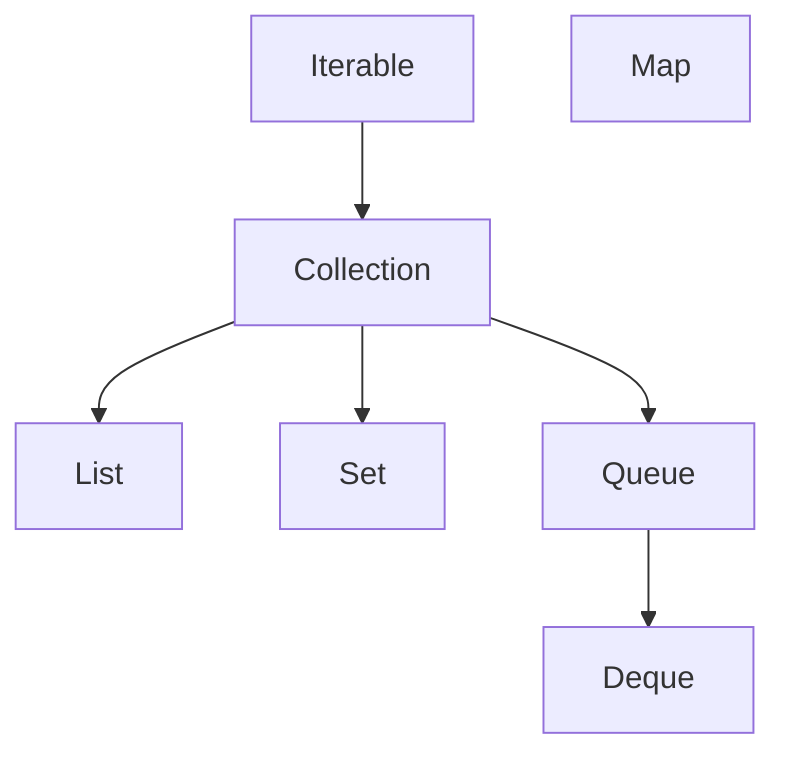

# Coleções: array vs. List, Set, Map

A `Prateleira` do capítulo anterior herda do array a limitação de nascença: a
capacidade é fixada no `new`, e um carrinho de compras não sabe de antemão
quantos itens vai ter. Crescer um array é criar outro maior e copiar tudo, e
esse serviço, junto com dezenas de outros, a biblioteca padrão já presta,
num conjunto de tipos que todo programa Java usa todos os dias:

```java
List<ItemDeVenda> carrinho = new ArrayList<>();
carrinho.add(new ItemDeVenda(cafe, 2));
carrinho.add(new ItemDeVenda(queijo, 1));
IO.println(carrinho.size());
IO.println(carrinho.get(0).subtotal());
```

Este capítulo apresenta as três estruturas que respondem pela quase
totalidade do uso real, `List`, `Set` e `Map`, com o critério de escolha
entre elas, e a árvore de interfaces que as organiza, completada pela fila,
`Queue`. Como cada estrutura funciona por dentro é assunto de estrutura de
dados, uma disciplina inteira que fica fora deste livro; o que entra aqui é
o que se usa e o que se pergunta em entrevista.

## A árvore: de Iterable a Queue

Os tipos deste capítulo não são avulsos: formam uma árvore de interfaces
ligadas por herança, e quem conhece o desenho dela lê dezenas de
assinaturas da biblioteca sem decorar nenhuma. A definição que ancora tudo:
uma coleção é um objeto que reúne múltiplos elementos numa única unidade.
No topo da árvore está `Iterable`, o contrato de quem pode ser percorrido,
com um único método essencial, `iterator()`, que entrega o objeto de
percurso; é exatamente o que o for-each exige, e qualquer `Iterable` serve
nele (o array, que fica fora da árvore, recebe do compilador um
tratamento à parte). De `Iterable` herda `Collection`, o contrato geral
das coleções de fato: o que vale para qualquer grupo de elementos mora nela,
`add`, `remove`, `contains`, `size`, `isEmpty`. E de `Collection` descem as
três especializações, cada uma acrescentando uma promessa ao contrato de
`Collection`: `List` promete posição, `Set` promete ausência de duplicata, e `Queue`
promete uma disciplina de saída, tipicamente a ordem de chegada.

`Map` fica fora da árvore de propósito: um dicionário de chave para valor
não é um grupo de elementos soltos, e forçá-lo no contrato de `Collection`
estragaria os dois. Ele encabeça uma hierarquia própria, paralela e menor.



O padrão de leitura da biblioteca sai do diagrama: a interface diz o
contrato, e a implementação diz a mecânica no prefixo do nome, `ArrayList`
para `List`, `HashSet` para `Set`, `HashMap` para `Map`, `ArrayDeque` para
a fila. O resto do capítulo desce a árvore ramo por ramo.

## List e ArrayList

`List` é uma interface, no sentido pleno da palavra: o contrato de uma
sequência de tamanho variável, com posição, cujos métodos aposentam o
improviso de crescer array à mão: `add` acrescenta no fim, `get(i)` lê pela
posição, `size()` conta, `remove` tira, `contains` procura usando `equals`.
`ArrayList` é a implementação padrão do contrato: guarda os elementos num
array interno e o troca por um maior quando enche, sozinha. A declaração
segue a lição de programar contra o contrato:

```java
List<ItemDeVenda> carrinho = new ArrayList<>();
```

A variável é do tipo da interface e o `new` escolhe a implementação, no
mesmo desenho do `MeioDePagamento`: o resto do código depende só de `List`,
e trocar a implementação um dia não toca linha nenhuma. O parâmetro de
tipo é quem faz `get` devolver `ItemDeVenda` sem cast e o compilador
recusar qualquer intruso no `add`; a assinatura do construtor de cópia,
`new ArrayList<>(colecao)`, traz o wildcard `? extends` trabalhando,
aceitando qualquer `Collection`.

O repertório de `List` vai além do essencial da abertura, e o cartaz de
ofertas da feira serve de bancada:

```java
List<String> cartaz = new ArrayList<>();
cartaz.add("banana");
cartaz.add("alface");
cartaz.add("tomate");
cartaz.add(1, "couve");
cartaz.set(0, "banana prata");
IO.println(cartaz);
IO.println(cartaz.indexOf("tomate"));
```

```
[banana prata, couve, alface, tomate]
3
```

O `add` de dois argumentos insere na posição dada e empurra os seguintes
uma casa adiante, por isso a couve entrou na posição 1 e a alface passou
para a 2. O `set` troca o elemento da posição pelo novo, sem empurrar
ninguém, e devolve o que saiu. O `indexOf` procura com `equals` e devolve
a posição da primeira ocorrência, ou `-1` quando não encontra, a convenção
de "não achei" das buscas por posição. O repertório do dia a dia, na mesma
bancada:

| Chamada | Efeito |
| --- | --- |
| `cartaz.add("tomate")` | acrescenta no fim |
| `cartaz.add(1, "couve")` | insere na posição 1 e empurra os seguintes |
| `cartaz.get(0)` | lê pela posição |
| `cartaz.set(0, "banana prata")` | troca na posição, sem empurrar, e devolve o que saiu |
| `cartaz.remove(2)` | tira pela posição |
| `cartaz.remove("alface")` | tira a primeira ocorrência igual, pelo `equals` |
| `cartaz.contains("tomate")` | pergunta pela presença, com `equals` |
| `cartaz.indexOf("tomate")` | posição da primeira ocorrência; `-1` se não achar |
| `cartaz.size()` / `cartaz.isEmpty()` | quantos elementos / se está vazia |
| `cartaz.addAll(outroCartaz)` | despeja outra coleção inteira no fim |
| `cartaz.subList(1, 3)` | vista das posições de 1 até antes de 3 |
| `cartaz.clear()` | esvazia |

Uma chamada da tabela devolve algo diferente das outras: `cartaz.subList(1, 3)`
entrega as posições de 1 até antes de 3 como uma vista, e vista quer dizer
que os dois objetos compartilham o mesmo conteúdo. Alterar um elemento
pela vista altera a lista original, e alterar o tamanho da original
invalida a vista, que passa a lançar erro no primeiro uso. Serve para
trabalhar num trecho sem copiar; para levar o trecho embora, copia-se com
`new ArrayList<>(cartaz.subList(1, 3))`.

As duas formas de `remove`, pela posição e pelo elemento, carregam uma
armadilha guardada para a seção dos wrappers. Sobre o custo, o suficiente
para decidir: `get` e `set` são saltos diretos no array interno, e inserir
ou remover no meio empurra os elementos seguintes, um preço que só aparece
em listas grandes.

A pergunta de entrevista mora na segunda implementação da ficha:
`LinkedList` guarda os elementos em nós encadeados, cada um apontando para o
seguinte, em vez de num array contíguo. Na teoria, inserir no meio dela é
mais barato; na prática, percorrer nós espalhados pela memória perde de
longe para varrer um array contíguo, e o `get(i)` dela precisa caminhar até
a posição. A resposta honesta, que serve para a entrevista e para o código:
`ArrayList` é a escolha padrão, praticamente sempre, e `LinkedList` é a
resposta de uma pergunta clássica, não uma ferramenta do dia a dia.

## Wrappers e autoboxing

`List<int>` não compila. Parâmetro de tipo aceita só tipo de objeto, e para
cada primitivo a biblioteca tem uma classe wrapper que o
embrulha como objeto: `Integer` para `int`, `Long`, `Double`, `Boolean` e
`Character` para os demais. O `Integer.parseInt` do capítulo 5 morava
exatamente nessa classe, e a promessa de apresentar a família vence aqui. A
conversão é automática nas duas direções: autoboxing na ida do primitivo
para o wrapper, unboxing na volta.

```java
List<Integer> quantidades = new ArrayList<>();
quantidades.add(3);
int primeira = quantidades.get(0);
```

O `3` entra como `Integer` e sai como `int` sem cerimônia visível. Cada
classe wrapper carrega também o que o primitivo não tem onde guardar: as
constantes `Integer.MAX_VALUE` e `Integer.MIN_VALUE`, que são os limites do
capítulo 3 escritos em código em vez de digitados à mão; as conversões
`Integer.parseInt` e `Double.parseDouble`, com uma irmã por tipo; e
comparações prontas como `Integer.compare(a, b)`, que devolve negativo,
zero ou positivo sem o risco que uma armadilha do capítulo 18 vai
mostrar. E é fácil esquecer que wrapper é objeto, com tudo que vale para
objetos:

<div class="armadilha">

Quatro caixas de leite e um limite de estoque:

```java
void main() {
    Integer contagem = 127;
    Integer limite = 127;
    IO.println(contagem == limite);

    Integer contagemMaior = 128;
    Integer limiteMaior = 128;
    IO.println(contagemMaior == limiteMaior);
}
```

```
true
false
```

O mesmo código, com 127 responde `true` e com 128 responde `false`.

</div>

`==` entre wrappers compara referências, como entre quaisquer objetos, e o
resultado depende de os dois lados serem o mesmo objeto. Para valores
pequenos eles costumam ser, pelo mecanismo do aprofundamento abaixo; de 128
em diante deixam de ser, e a comparação que passou em todos os testes
pequenos erra em produção com os números grandes. A regra de sempre não
ganha exceção para números: wrapper se compara com `equals`, e
`contagemMaior.equals(limiteMaior)` responde `true` sempre. Uma variante dessa
armadilha: um `Integer` nulo atribuído a um `int` explode com
`NullPointerException` na conversão automática, e a linha nem parece tocar
em referência.

<div class="aprofundamento">

**O cache dos wrappers.** A conversão automática de `int` para `Integer`
reaproveita objetos prontos para os valores de −128 a 127, e por isso dois
`127` são o mesmo objeto e dois `128` não. O intervalo pequeno é justamente
o mais usado em teste, o que faz o `==` de wrapper parecer correto até o
primeiro valor grande de verdade.

</div>

A armadilha prometida na seção de `List` também nasce dos wrappers.

<div class="armadilha">

O painel de senhas do açougue guarda as senhas em espera, e o cliente da
senha 2 foi embora:

```java
void main() {
    List<Integer> senhasEmEspera = new ArrayList<>();
    senhasEmEspera.add(5);
    senhasEmEspera.add(2);
    senhasEmEspera.add(8);
    senhasEmEspera.remove(2);
    IO.println(senhasEmEspera);
}
```

```
[5, 2]
```

A senha 2 continua na lista, e a senha 8 sumiu.

</div>

`List` tem dois `remove`: um recebe `int` e tira pela posição, outro recebe
objeto e tira o elemento igual. O literal `2` casa exato com a versão de
posição, e o compilador nem considera o autoboxing, porque entre uma
conversão exata e uma que embrulha, a exata vence sempre. A linha removeu a
posição 2, que era a senha 8, sem erro e sem aviso, e o painel seguiu
chamando um cliente que já foi atendido. A forma de dizer "o valor 2" é
embrulhar de propósito: `senhasEmEspera.remove(Integer.valueOf(2))`, e o
teste da fila de senhas pega a diferença.

## Set e HashSet: sem duplicatas

`Set` é o contrato do conjunto: coleção que recusa duplicata, onde duplicata
é definida pelo `equals`. `HashSet` é a implementação padrão, e o nome
entrega a mecânica: é a estrutura que usa o código de hash
para achar a vizinhança de um elemento num salto, em vez de comparar com
todos. O estoque do mercadinho não deve ter o mesmo produto duas vezes, e o
`Set` transforma essa regra de disciplina em propriedade da estrutura: o
`add` de um produto igual a um presente devolve `false` e não insere.

| Chamada | Efeito |
| --- | --- |
| `estoque.add(produto)` | insere; devolve `false` e não insere se um igual já está lá |
| `estoque.contains(produto)` | pergunta pela presença, pelo hash e depois pelo `equals` |
| `estoque.remove(produto)` | tira o elemento igual, se houver |
| `estoque.size()` / `estoque.isEmpty()` | herdados de `Collection`, como em `List` |

As três operações de conjunto da matemática têm método próprio, e cada uma
altera o conjunto que recebe a chamada: `addAll` faz a união, `retainAll`
guarda só o que existe nos dois, a interseção, e `removeAll` tira tudo que
existe no outro, a diferença; `containsAll` pergunta se um contém o outro
inteiro. A promoção da semana que ainda tem estoque sai de uma linha:

```java
void main() {
    Set<String> emPromocao = new TreeSet<>(Set.of("Arroz 5kg", "Café 500g", "Sabão em pó"));
    Set<String> emFalta = Set.of("Arroz 5kg", "Queijo minas");

    Set<String> promocaoDisponivel = new TreeSet<>(emPromocao);
    promocaoDisponivel.removeAll(emFalta);
    IO.println(promocaoDisponivel);
}
```

```
[Café 500g, Sabão em pó]
```

A cópia antes do `removeAll` existe porque a operação altera o conjunto
que a recebe, e a promoção da semana não deveria encolher por causa de uma
consulta. `TreeSet`, usado ali para a saída ter ordem previsível, é o
`Set` que mantém os elementos ordenados, e `LinkedHashSet` é o que lembra
a ordem de inserção: o mesmo trio dos mapas, que a seção de ordem de
iteração fecha. E quando os elementos são constantes de um enum existem
implementações dedicadas, `EnumSet` e `EnumMap`, que guardam os valores
num vetor indexado pela posição da constante: ocupam menos memória, são
mais rápidas e iteram na ordem de declaração do enum, o que as torna a
escolha padrão para chave de enum.

O capítulo 10 prometeu mostrar ao vivo o preço de sobrescrever `equals` sem
`hashCode`, e o palco é este:

<div class="armadilha">

Um `Produto` com `equals` correto pelo código de barras e `hashCode`
esquecido, herdado de `Object`:

```java
void main() {
    Set<Produto> estoque = new HashSet<>();
    estoque.add(new Produto("7891000100103", "Café 500g", new BigDecimal("19.90")));
    IO.println(estoque.contains(new Produto("7891000100103", "Café 500g", new BigDecimal("19.90"))));
}
```

```
false
```

Os dois objetos são iguais pelo `equals`, o produto está no conjunto, e o
`contains` diz que não.

</div>

O `HashSet` procura pelo hash primeiro: calcula o do produto perguntado,
salta para a vizinhança correspondente e só ali usa `equals`. Com o
`hashCode` herdado, os dois cafés iguais têm hashes de identidade
diferentes, a busca olha a vizinhança errada e o produto some sem sair do
lugar. Pior: por coincidência de vizinhança, uma execução aqui e ali pode
encontrar, e defeito intermitente escapa do teste e volta em produção. É a cláusula
do contrato de equals cobrada pela estrutura que confia nela, e a correção
é a de sempre: sobrescreveu `equals`, sobrescreve `hashCode`, sobre os mesmos campos.

## Queue e Deque: a disciplina da fila

O mercadinho anota encomendas por telefone e as entrega na ordem em que
chegaram. `Queue` é o contrato dessa disciplina: a fila, em que os
elementos saem na ordem em que entraram, o regime FIFO (*first in, first
out*, primeiro a entrar, primeiro a sair):

```java
Queue<String> encomendas = new ArrayDeque<>();
encomendas.offer("Dona Marta: 2 café, 1 açúcar");
encomendas.offer("Seu Jorge: 1 queijo minas");
IO.println(encomendas.peek());
IO.println(encomendas.poll());
IO.println(encomendas.poll());
IO.println(encomendas.poll());
```

```
Dona Marta: 2 café, 1 açúcar
Dona Marta: 2 café, 1 açúcar
Seu Jorge: 1 queijo minas
null
```

`offer` entra no fim, `poll` sai pela frente, e `peek` espia a frente sem
tirar; com a fila vazia, `poll` e `peek` devolvem `null` em vez de lançar,
e o percurso de entregas termina quando o `poll` devolve o primeiro `null`.
A implementação, `ArrayDeque`, cumpre na verdade um contrato mais rico:
`Deque` (*double-ended queue*, fila de duas pontas) estende `Queue` com
operações nas duas extremidades. Com as duas pontas, o mesmo objeto serve
de pilha, a estrutura em que o último a entrar é o primeiro a sair, o
regime LIFO (*last in, first out*), o mesmo desenho da pilha de chamadas:
`push` empilha e `pop` desempilha, ambos na mesma ponta. A classe `Stack`,
dos primeiros anos da linguagem, fazia esse papel e sobrevive em código
antigo; código novo empilha com `ArrayDeque`.

| Chamada | Efeito |
| --- | --- |
| `encomendas.offer(pedido)` | entra no fim da fila |
| `encomendas.poll()` | sai pela frente; `null` se a fila está vazia |
| `encomendas.peek()` | espia a frente sem tirar; `null` se vazia |
| `pilha.push(pedido)` | empilha, com o `Deque` servindo de pilha |
| `pilha.pop()` | desempilha da mesma ponta |

Uma segunda implementação de `Queue` troca a ordem de chegada por outra
disciplina. `PriorityQueue` entrega sempre o menor elemento primeiro, pela
ordem natural do tipo, e não pela ordem de entrada: é a fila do
pronto-socorro, não a da padaria. As encomendas do mercadinho atendidas da
mais urgente para a menos, ou os produtos ordenados por dias até vencer,
são os casos que a pedem. A advertência que acompanha vale mais que a
apresentação: a ordem prometida existe na saída, `poll` a `poll`, e não no
percurso. Imprimir um `PriorityQueue` inteiro, ou percorrê-lo com
for-each, mostra os elementos na ordem interna da estrutura, que não é a
ordenada, e essa é a surpresa clássica de quem a usa pela primeira vez.

No uso real a fila aparece
menos que `List` e `Map`; na entrevista, FIFO contra LIFO é pergunta de
aquecimento, e a resposta agora tem código.

## Map e HashMap: de chave para valor

`Map` é o contrato do dicionário: pares de chave e valor, com busca pela
chave. É a estrutura do estoque de verdade, do código de barras para o
produto, e `HashMap` é a implementação padrão, com a mesma mecânica de hash
do `HashSet` aplicada às chaves:

```java
Map<String, Produto> estoque = new HashMap<>();
estoque.put("7891000100103", cafe);
estoque.put("7891000200100", queijo);

Produto achado = estoque.get("7891000100103");
Produto ausente = estoque.get("0000000000000");
IO.println(achado.nome());
IO.println(ausente);
```

```
Café 500g
null
```

`put` grava o par, sobrescrevendo o valor se a chave já existia, e `get`
devolve o valor ou `null` quando a chave não está lá: é o reencontro
marcado no capítulo 5, a busca que pode legitimamente não ter resposta.
Consultar antes com `containsKey`, ou usar `getOrDefault(chave, valorPadrao)`,
evita o `NullPointerException` de quem esquece o caso ausente. O idioma de
contagem, presente em todo sistema e em toda entrevista, junta as duas
pontas:

```java
var vendasPorCategoria = new HashMap<Categoria, Integer>();
for (ItemDeVenda item : itensDoDia) {
    Categoria categoria = item.produto().categoria();
    int atual = vendasPorCategoria.getOrDefault(categoria, 0);
    vendasPorCategoria.put(categoria, atual + item.quantidade());
}
```

O `var` do capítulo 3, prometido para quando os nomes de tipo crescessem,
entra em cena aqui, com uma ressalva: ele deduz o tipo concreto, `HashMap`
e não `Map`, então serve às variáveis locais curtas e cede a vez quando a
disciplina da interface importa. E o percurso idiomático dos pares usa
`entrySet()`:

```java
for (Map.Entry<Categoria, Integer> entrada : vendasPorCategoria.entrySet()) {
    IO.println(entrada.getKey() + ": " + entrada.getValue());
}
```

Cada entrada carrega chave e valor juntos, sem a segunda busca que o par
`keySet` e `get` faria; `Entry` é um tipo declarado dentro de `Map`, e daí
vem o nome composto `Map.Entry`. O repertório de `Map`, sobre o estoque:

| Chamada | Efeito |
| --- | --- |
| `estoque.put(codigo, produto)` | grava o par; sobrescreve o valor se a chave já existia |
| `estoque.get(codigo)` | o valor, ou `null` quando a chave não está lá |
| `estoque.getOrDefault(codigo, padrao)` | o valor, ou o padrão, sem `null` no caminho |
| `estoque.containsKey(codigo)` | pergunta se a chave existe |
| `estoque.remove(codigo)` | tira o par da chave |
| `estoque.keySet()` / `estoque.entrySet()` | as chaves / os pares, para percorrer |
| `estoque.size()` / `estoque.isEmpty()` | quantos pares / se está vazio |

## Ordem de iteração

<div class="previsao">

As vendas do dia entram no mapa na ordem em que aconteceram:

```java
Map<String, Integer> vendas = new HashMap<>();
vendas.put("Café 500g", 3);
vendas.put("Arroz 5kg", 1);
vendas.put("Sabão em pó", 2);
vendas.put("Queijo minas", 4);
for (String nome : vendas.keySet()) {
    IO.println(nome + ": " + vendas.get(nome));
}
```

Em que ordem os quatro produtos saem?

</div>

```
Arroz 5kg: 1
Queijo minas: 4
Café 500g: 3
Sabão em pó: 2
```

Em ordem nenhuma que se reconheça: nem a de inserção, nem a alfabética. A
ordem de iteração de um `HashMap` é consequência dos hashes das chaves, um
detalhe interno sem promessa nenhuma, que muda entre versões e
implementações. Relatório que depende da ordem de um `HashMap` é bug agendado, e a
regra é declarar a ordem quando ela for requisito. `TreeMap` é a
implementação que mantém as chaves ordenadas, e a ordem vem de `Comparable`:
a interface de quem sabe se comparar com os da própria espécie, com um único
método, `compareTo`, devolvendo negativo, zero ou positivo, exatamente o
protocolo do `BigDecimal`. `String` e os wrappers
já a implementam, e trocar `new HashMap<>()` por `new TreeMap<>()` na
previsão faria os produtos saírem em ordem alfabética. A ordem mantida
abre consultas que o `HashMap` não tem como responder: `firstKey` e
`lastKey` entregam os extremos, `headMap(chave)` e `tailMap(chave)`
recortam a faixa antes e a faixa a partir de uma chave, e `floorKey` e
`ceilingKey` respondem "a maior chave até esta" e "a menor chave a partir
desta". É o que transforma o mapa ordenado na estrutura das consultas por
faixa, de preço, de data ou de código. Existe ainda o meio-termo, e ele cai em entrevista: `LinkedHashMap` guarda
os pares com a mecânica do `HashMap` e lembra a ordem de inserção; na
previsão acima, devolveria os quatro produtos na ordem em que entraram. A
resposta de entrevista vira um trio, nos mesmos moldes da de `List`:
`HashMap` por padrão, pela busca em um salto e sem promessa de ordem;
`LinkedHashMap` quando a ordem de chegada importa; `TreeMap` quando a
ordem das chaves é requisito do problema, pagando a busca mais lenta.

Um tipo nosso entra no `TreeMap` implementando a interface:

```java
public class Produto implements Comparable<Produto> {
    @Override
    public int compareTo(Produto outro) {
        return nome.compareTo(outro.nome);
    }
}
```

E quando a ordem desejada não é a natural do tipo, ou o tipo não tem
nenhuma, o capítulo 18 traz a peça que falta.

## A classe Collections

Assim como `Arrays` reúne as operações de array, `Collections` reúne as
que valem para qualquer coleção, e é a segunda classe utilitária do livro.
O `s` final é o que separa a classe utilitária `Collections` da interface
`Collection` do topo da árvore, e a confusão entre as duas é frequente o
bastante para o aviso valer a linha.

```java
void main() {
    List<String> fila = new ArrayList<>(List.of("Ana", "Bruno", "Carla"));
    Collections.reverse(fila);
    IO.println(fila);
    IO.println(Collections.max(fila));
    IO.println(Collections.frequency(fila, "Ana"));
}
```

```
[Carla, Bruno, Ana]
Carla
1
```

`reverse` inverte a lista no lugar, alterando o objeto recebido, como quase
tudo nesta classe; `max` e `min` percorrem qualquer coleção devolvendo o
extremo pela ordem natural do tipo, a mesma de `Comparable`; `frequency`
conta ocorrências.

| Chamada | O que faz |
| --- | --- |
| `Collections.sort(lista)` | ordena no lugar, pela ordem natural do tipo |
| `Collections.reverse(lista)` | inverte a ordem dos elementos |
| `Collections.shuffle(lista, aleatorio)` | embaralha, com o gerador do capítulo 6 |
| `Collections.max(colecao)` / `min(colecao)` | o maior / o menor pela ordem natural |
| `Collections.frequency(colecao, valor)` | quantas vezes o valor aparece |
| `Collections.swap(lista, i, j)` | troca duas posições entre si |
| `Collections.unmodifiableList(lista)` | vista da lista que recusa alteração |
| `Collections.emptyList()` | a lista vazia imutável, para devolver em vez de `null` |

O `shuffle` com o gerador do capítulo 6 é o embaralhamento reprodutível:
com semente fixa, a mesma ordem em toda execução, que é o que torna um
teste possível. E as duas últimas linhas da tabela pedem cuidado com uma
diferença que a leitura rápida apaga. `Collections.unmodifiableList` devolve
uma vista, no sentido do `subList`: o objeto recusa `add` e `remove`, e
continua enxergando a lista original, de modo que uma alteração feita por
quem tem a referência de dentro aparece através dela. `List.copyOf`, da
próxima seção, copia, e o que acontecer depois com a original não afeta a
cópia. Para devolver a lista interna de um objeto sem deixar ninguém
alterá-la, a cópia é a defesa inteira e a vista é meia defesa.

## Coleções imutáveis

As três interfaces têm fábricas de exemplares que nascem prontos e não
mudam:

```java
List<String> diasDeFeira = List.of("terça", "sexta");
Set<String> meiosAceitos = Set.of("dinheiro", "pix", "cartão");
Map<Categoria, BigDecimal> descontosDaFeira = Map.of(Categoria.HORTIFRUTI, new BigDecimal("0.10"));
```

Uma coleção imutável recusa `add`, `remove` e `put` com um erro de execução
imediato e barulhento, `UnsupportedOperationException`, e o erro imediato é
o serviço prestado: ele transforma "ninguém deveria mexer nisto" em
"ninguém consegue". Os usos
que pagam a passagem: constantes de domínio, como os dias de feira, e
retorno defensivo, devolvendo `List.copyOf(itens)` para quem pede a lista
interna, em vez da referência viva que outros alteram por fora. E a pendência do capítulo 11 fecha aqui: sequência dentro
de record é `List` imutável, garantida no construtor compacto:

```java
public record PesagensDoDia(List<Integer> gramas) {
    public PesagensDoDia {
        gramas = List.copyOf(gramas);
    }
}
```

O `copyOf` blinda contra a lista viva de quem chamou, o `equals` gerado
passa a comparar conteúdo, porque `List` o faz, e a armadilha do componente
array morre de vez.

Resta pagar o topo da árvore: o iterador, que o `iterator()` de `Iterable`
entrega, é o objeto que percorre uma coleção, um elemento por vez, e é ele
que o for-each usa por baixo em tudo que este capítulo mostrou. Escrito por extenso, o percurso mostra o que o for-each esconde, e essa
forma longa é também a única maneira de remover elementos durante a volta
sem as peças do capítulo 18:

```java
Iterator<Produto> percurso = estoque.iterator();
while (percurso.hasNext()) {
    Produto produto = percurso.next();
    if (produto.estoque() == 0) {
        percurso.remove();
    }
}
```

`hasNext` pergunta se ainda há elemento pela frente, `next` entrega o
próximo e avança, e `remove` tira da coleção o elemento que o `next`
acabou de entregar, avisando a estrutura da alteração. É justamente esse
aviso que falta quando a remoção é feita por fora: alterar a coleção no meio
de um for-each costuma derrubar o
programa com `ConcurrentModificationException`, um erro barulhento de
propósito. A detecção, porém, é melhor esforço, não garantia: há casos, como
remover o penúltimo elemento de um `ArrayList`, em que o percurso termina em
silêncio, corrompido. A regra vale sem exceção de sorte: não alterar dentro
do for-each, nunca; a remoção por critério tem forma própria e curta no
capítulo 18.

## Prática

1. Refaça o `Carrinho` do capítulo 8 sobre `List<ItemDeVenda>`, com `total()`
   em `BigDecimal`, e aposente os arrays paralelos de vez.

2. Reproduza a armadilha dos wrappers com os valores 127 e 128, conserte com
   `equals` e escreva a regra em uma frase. Depois provoque o
   `NullPointerException` do unboxing com um `Integer` nulo, e refaça o
   painel de senhas removendo a senha certa com `Integer.valueOf`.

3. Modele a fila de encomendas da entrega em domicílio com `Queue<String>`:
   chegada com `offer`, atendimento com `poll`, espiada com `peek`, e o
   encerramento correto quando a fila esvazia. Depois use um `ArrayDeque`
   como pilha e escreva em uma frase a diferença entre os dois regimes.

4. Reproduza o desaparecimento no `HashSet` com um `Produto` sem `hashCode`,
   conserte sobrescrevendo, e rode dez vezes cada versão anotando os
   resultados. Explique por escrito por que a versão errada poderia passar
   num teste.

5. Monte o estoque como `Map<String, Produto>` com cinco produtos, escreva a
   consulta que responde "existe? qual o preço?" sem risco de
   `NullPointerException`, e o relatório de contagem por categoria com
   `getOrDefault`.

6. Monte um `TreeMap<Produto, Integer>` de vendas por produto e observe a
   ordem seguir o `compareTo` por nome. Depois troque a ordem natural de
   `Produto` para preço, decidindo com `compareTo` de `BigDecimal`, e anote
   o que muda na saída.

7. Escreva um método que receba `List<ItemDeVenda>` e devolva uma versão
   imutável dela, e prove com uma tentativa de `add` que a devolução é
   segura. Depois compare `Collections.unmodifiableList` com `List.copyOf`:
   altere a lista original depois de devolver as duas e mostre qual das
   devoluções mudou junto.

8. Modele com `Set` a promoção da semana e a lista de produtos em falta, e
   produza os três resultados com operações de conjunto: o que está em
   promoção e disponível, o que está nas duas listas e a união das duas.
   Guarde-os em `TreeSet` para a saída sair em ordem e explique por escrito
   por que a cópia antes de `removeAll` é necessária.

9. Percorra o estoque com um `Iterator` explícito e remova os produtos
   zerados. Depois reescreva a mesma remoção dentro de um for-each, rode, e
   anote o erro. Explique em duas frases o que o `remove` do iterador faz
   que a remoção por fora não faz.

10. Ponha cinco encomendas com prazos diferentes num `PriorityQueue`,
    esvazie-o com `poll` anotando a ordem de saída, e depois imprima um
    `PriorityQueue` cheio com `IO.println`. Explique a diferença entre as
    duas ordens.

## Ficha do capítulo

| Chamada | O que faz |
| --- | --- |
| `add` / `get(i)` / `size()` / `remove` / `contains` | o essencial de `List` |
| `add(i, e)` / `set(i, e)` / `indexOf` / `isEmpty` / `clear` / `addAll` | o resto do dia a dia de `List` |
| `offer` / `poll` / `peek` | fila: entra no fim, sai da frente, espia; vazia devolve `null` |
| `push` / `pop` | pilha sobre `Deque`: empilha e desempilha na mesma ponta |
| `put` / `get` / `getOrDefault` / `containsKey` | o essencial de `Map`; `get` ausente devolve `null` |
| `keySet()` / `entrySet()` | as chaves / os pares, para percorrer |
| `addAll` / `retainAll` / `removeAll` | união, interseção e diferença entre conjuntos |
| `firstKey` / `headMap` / `floorKey` | consultas de faixa, exclusivas do mapa ordenado |
| `Collections.sort` / `reverse` / `shuffle` / `max` / `frequency` | a utilitária das coleções |
| `iterator()` / `hasNext` / `next` / `remove` | o percurso por extenso, com remoção segura |
| `List.of`, `Set.of`, `Map.of`, `List.copyOf` | coleções imutáveis prontas |

| Termo | Definição |
| --- | --- |
| coleção | objeto que reúne múltiplos elementos numa única unidade |
| `Iterable` | o contrato de quem pode ser percorrido; `iterator()`; exigência do for-each |
| `Collection` | o contrato de que `List`, `Set` e `Queue` herdam; `Map` fica à parte |
| `List` / `ArrayList` | sequência com posição / implementação padrão, sobre array que cresce |
| `LinkedList` | nós encadeados; resposta de entrevista, raramente a escolha certa |
| `Set` / `HashSet` | conjunto sem duplicatas (por `equals`) / implementação por hash |
| `Map` / `HashMap` | pares chave-valor / implementação por hash, sem ordem prometida |
| `LinkedHashMap` | mecânica de `HashMap` lembrando a ordem de inserção |
| `TreeMap` | chaves mantidas em ordem, via `Comparable` |
| `Queue` / `ArrayDeque` | a fila FIFO: sai na ordem de chegada / implementação padrão |
| `PriorityQueue` | sai sempre o menor; a ordem vale na saída, não no percurso |
| `TreeSet` / `LinkedHashSet` | conjunto ordenado / conjunto que lembra a inserção |
| `EnumSet` / `EnumMap` | implementações dedicadas a constantes de enum |
| `Collections` | a classe utilitária das coleções; não confundir com `Collection` |
| vista | objeto que compartilha o conteúdo de outro: `subList`, `unmodifiableList` |
| `Deque` | fila de duas pontas; serve de fila e de pilha (LIFO) |
| `Comparable` / `compareTo` | a ordem natural de um tipo: negativo, zero, positivo |
| classe wrapper | o primitivo como objeto: `Integer`, `Double` e os demais |
| autoboxing / unboxing | conversão automática primitivo→wrapper e a volta; `==` continua proibido |
| iterador | o objeto que percorre a coleção; motor do for-each |
| ordem de iteração | `HashMap`/`HashSet` não prometem nenhuma; `TreeMap` promete a das chaves |
| coleção imutável | nasce pronta e recusa alteração com erro imediato |
