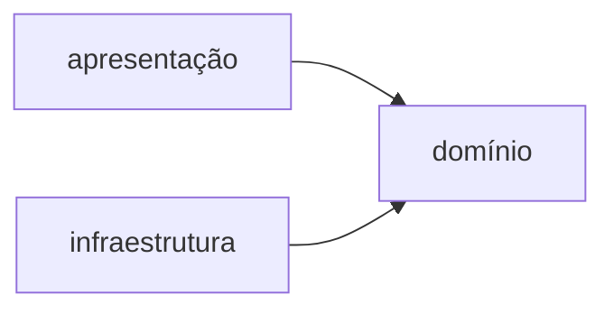

# Projeto integrador: arquitetura e MVC no terminal

Vinte e quatro capítulos produziram todas as peças do mercadinho: produto e
código de barras, caixa e pagamentos, estoque em arquivo, testes, injeção.
Falta a decisão que transforma peças em sistema, e ela não é uma classe
nova: é responder, para cada classe existente, onde ela mora e quem pode
conhecer quem. A resposta é a estrutura final do projeto:

```
src/main/java/br/com/mercadinho/
├── dominio/
│   ├── Produto.java            CodigoDeBarras.java
│   ├── ItemDeVenda.java        Categoria.java
│   ├── Caixa.java              CadernetaDeFiado.java
│   ├── MeioDePagamento.java    Resultado.java
│   └── RepositorioDeProdutos.java
├── infraestrutura/
│   └── RepositorioEmArquivo.java
├── apresentacao/
│   ├── TelaDoTerminal.java
│   └── Impressora.java
└── Principal.java
```

## As três camadas

A estrutura de pastas é a fotografia de três camadas, e cada uma tem
definição de uma frase. A camada de domínio contém as regras do negócio, os
tipos e as operações que existiriam em qualquer versão do mercadinho, sem
saber que terminal, arquivo ou banco existem. A camada de infraestrutura
contém as bordas técnicas, as classes que tocam o mundo, implementando
contratos que o domínio declara: o `RepositorioEmArquivo` do capítulo 21
cumprindo o `RepositorioDeProdutos` do capítulo 24. A camada de apresentação
contém a conversa com quem usa: ler comandos, mostrar resultados, e nada
além disso.

O que faz das três uma arquitetura é a regra de dependência, uma só e sem
exceção: as setas apontam para o domínio, e o domínio não aponta para
ninguém.



A apresentação chama o domínio; a infraestrutura implementa interfaces do
domínio; e o domínio compila sem que as outras duas existam, porque nenhum
`import` dele as menciona. Todo o investimento do livro converge nessa
regra: as interfaces do capítulo 9 são o que permite a seta da
infraestrutura apontar para dentro, a injeção do capítulo 24 é o que poupa o
domínio de criar as bordas, e o pacote do capítulo 7 é o muro que torna a
regra visível numa listagem de pastas.

<div class="previsao">

A regra de dependência é verificável com o compilador, sem ferramenta
nenhuma:

```console
$ javac -d saida src/main/java/br/com/mercadinho/dominio/*.java
$ javac -d saida src/main/java/br/com/mercadinho/apresentacao/*.java
```

Um dos dois comandos funciona sozinho e o outro não. Qual, e por quê?

</div>

O primeiro compila: o domínio inteiro se resolve sem as outras camadas,
porque não importa nada delas. O segundo falha com uma fileira de
`cannot find symbol`, porque a apresentação importa o domínio e ele não está
no classpath do comando. A assimetria é a arquitetura em forma executável, e
vale como teste de saúde a qualquer momento: no dia em que o domínio parar
de compilar sozinho, alguma seta inverteu, e a inversão tem nome na
armadilha adiante.

## MVC

Dentro dessa organização, a camada de apresentação segue um padrão com nome
próprio. MVC, de Model-View-Controller, modelo, visão e controlador, é a
divisão da interação em três papéis: o modelo guarda o estado e as regras; a
visão apresenta o estado a quem usa; o controlador recebe o que o usuário
fez e traduz em chamadas ao modelo. No mercadinho de terminal, o modelo é a
camada de domínio inteira; a visão é a `Impressora`, que sabe transformar
resultados em texto; e o controlador é a `TelaDoTerminal`, o laço que lê
comandos e aciona o domínio:

```java
public class TelaDoTerminal {
    private final Caixa caixa;
    private final Impressora impressora;

    public TelaDoTerminal(Caixa caixa, Impressora impressora) {
        this.caixa = caixa;
        this.impressora = impressora;
    }

    public void rodar() {
        boolean aberto = true;
        while (aberto) {
            String comando = IO.readln("mercadinho> ");
            switch (comando) {
                case "vender" -> vender();
                case "estoque" -> impressora.listar(caixa.estoqueAtual());
                case "sair" -> aberto = false;
                default -> IO.println("Comandos: vender, estoque, sair");
            }
        }
    }

    private void vender() {
        String codigo = IO.readln("Código de barras: ");
        int quantidade = Integer.parseInt(IO.readln("Quantidade: "));
        Resultado resultado = caixa.vender(codigo, quantidade);
        impressora.mostrar(resultado);
    }
}
```

Cada linha vem de um capítulo, e nenhuma linha decide regra de negócio: o
controlador pergunta, converte e repassa; quem sabe se a venda pode
acontecer é o `Caixa`, e quem sabe escrever "Pago: R$ 39.80" é a
`Impressora`, com o switch de padrões do capítulo 12 sobre o `Resultado`.
Uma honestidade de terminal: nesta interface, visão e controlador são
vizinhos de porta, e a fronteira entre eles é mais fina do que o padrão
sugere; o MVC aparece em forma plena quando a interface tem eventos e
estado próprios, e os apêndices de interface gráfica mostram exatamente
isso. O que
não muda de interface para interface é o lado do modelo: regra de negócio
nunca mora na tela.

<div class="armadilha">

O mercadinho decide dar 5% de desconto para compras acima de R$ 100,00, e a
mudança é feita onde parecia mais fácil:

```java
private void vender() {
    String codigo = IO.readln("Código de barras: ");
    int quantidade = Integer.parseInt(IO.readln("Quantidade: "));
    Resultado resultado = caixa.vender(codigo, quantidade);
    if (resultado instanceof Aprovado(BigDecimal valor)
            && valor.compareTo(new BigDecimal("100.00")) > 0) {
        IO.println("Total com desconto: R$ " + valor.multiply(new BigDecimal("0.95")));
    } else {
        impressora.mostrar(resultado);
    }
}
```

A tela mostra o desconto, o cliente paga o valor da tela, e o sistema segue
sem nenhum erro. O que o fechamento do dia vai dizer?

</div>

Que faltou dinheiro na gaveta. O desconto existe só na impressão: o `Caixa`
registrou a venda pelo valor cheio, o relatório do capítulo 19 soma o valor
cheio, e a caderneta, os testes e o arquivo nunca souberam do desconto,
porque a regra nasceu na camada errada. Regra de negócio na apresentação é
uma regra que as outras vias do sistema não enxergam, e o sintoma é sempre
uma divergência entre o que a tela disse e o que o sistema registrou. A
correção é de endereço, não de código: a política de desconto entra no
`Caixa`, testada no `CaixaTest`, e a tela volta a só mostrar o `Resultado`.
O teste de saúde da previsão pega essa família inteira: regra na tela cria
`import` de domínio a mais e lógica onde só devia haver tradução.

## Testes por camada

A arquitetura paga o segundo dividendo na suíte. O domínio, onde mora tudo
que pode dar errado de verdade, testa-se com teste unitário puro: dublês em
memória via injeção, milissegundos por teste, dezenas de casos, todo o
arsenal dos capítulos 15 e 18. A infraestrutura testa-se pouco e de outro
jeito: alguns testes que escrevem e leem um arquivo temporário de verdade,
porque o assunto dela é exatamente o disco. E a apresentação quase não se
testa, de propósito: um controlador que só pergunta, converte e repassa não
tem regra para errar, e mantê-lo fino é o que mantém essa conta verdadeira.
A distribuição é o inverso da pirâmide de dificuldade: quanto mais perto do
mundo externo, menos testes e mais lentos; quanto mais perto do domínio,
mais testes e mais rápidos.

## Montagem, empacotamento e o sistema de pé

`Principal.java` é o ponto de montagem do capítulo 24, o jar executável é o
do capítulo 21, e a sessão final é a razão do livro:

```console
$ mvn package
[INFO] Tests run: 34, Failures: 0, Errors: 0, Skipped: 0
[INFO] BUILD SUCCESS
$ java -jar target/mercadinho-1.0.jar dados/estoque.txt
mercadinho> estoque
7891000100103  Café 500g      R$ 19.90  25 un
7891000200100  Queijo minas   R$ 39.80   8 un
mercadinho> vender
Código de barras: 7891000100103
Quantidade: 2
Pago: R$ 39.80
mercadinho> sair
$
```

Um arquivo, uma máquina com JDK, e o mercadinho atende. O sistema que essa
sessão mostra é pequeno; a estrutura dele é a mesma de sistemas grandes, e
essa é a aposta do capítulo: quem sabe onde cada coisa mora num sistema de
quinze classes sabe procurar num de mil e quinhentas. Os três apêndices
esticam exatamente este projeto, cada um por uma borda: o primeiro troca a
infraestrutura de arquivo por um banco de dados, e a regra de dependência
garante que o domínio não saberá; os outros dois trocam a apresentação de
terminal por uma interface gráfica, onde o MVC mostra a forma plena. O
domínio, coração do sistema e do livro, atravessa os três sem uma linha
editada.

<div class="aprofundamento">

**Nomes de mercado.** A organização deste capítulo aparece na literatura com
vários nomes, arquitetura em camadas, portas e adaptadores, arquitetura
hexagonal, cada um com refinamentos próprios sobre o mesmo núcleo: domínio
no centro, dependências apontando para dentro, bordas trocáveis. Quem
dominou a versão de três pastas lê qualquer um dos diagramas famosos como
variação, não como novidade.

</div>

## Prática

O projeto integrador é a prática, e os itens são incrementos completos, cada
um atravessando as camadas pelo caminho certo.

1. Monte o projeto na estrutura deste capítulo, migre todas as classes dos
   capítulos anteriores para as camadas, e faça o teste de saúde da
   previsão passar: o domínio compila sozinho.

2. Acrescente o comando `repor`, de ponta a ponta: leitura na tela, regra e
   validação no domínio, persistência na infraestrutura, e os testes no
   lugar certo de cada parte.

3. Implemente a política de desconto da armadilha no lugar certo, com o
   `Resultado` ganhando a informação do desconto aplicado, o switch da
   `Impressora` exibindo, e o teste provando que relatório e tela dizem o
   mesmo valor.

4. Acrescente o comando `relatorio`: total do dia, vendas por categoria e os
   três mais vendidos, tudo com os pipelines do capítulo 19 sobre os dados
   do domínio.

5. Acrescente o fiado como meio de pagamento no fluxo de venda, com a
   caderneta, o limite e a exceção do capítulo 13 atravessando as camadas
   até virarem uma mensagem digna na tela.

6. Rode o sistema inteiro pelo jar em outra pasta e em outra máquina se
   puder, com o estoque por argumento, e escreva um parágrafo sobre o que
   precisou de ajuste e o que rodou intocado.

## Ficha do capítulo

| Termo | Definição |
| --- | --- |
| camada de domínio | as regras do negócio; não conhece terminal, disco nem banco |
| camada de infraestrutura | as bordas técnicas; implementa contratos do domínio |
| camada de apresentação | a conversa com quem usa; pergunta, converte, repassa, mostra |
| MVC | modelo guarda estado e regras; visão mostra; controlador traduz entrada em chamadas |

| Regra prática | |
| --- | --- |
| dependência | setas para o domínio; o domínio não aponta para ninguém |
| teste de saúde | o domínio compila sozinho; quando parar, uma seta inverteu |
| regra de negócio | nunca na tela; divergência tela-relatório é o sintoma |
| testes | muitos e rápidos no domínio; poucos e reais na infraestrutura; apresentação fina |
